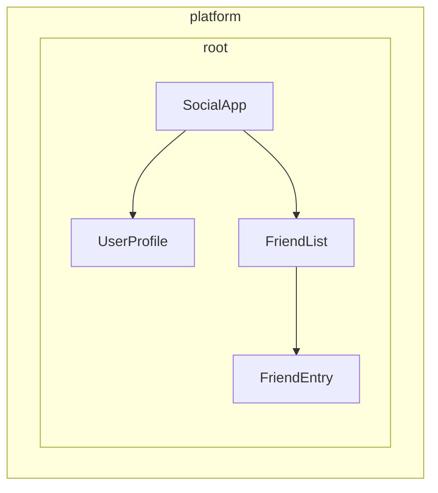

# 依存性プロバイダーの定義

Angularは、サービスを注入できるようにするための2つの方法を提供します。

1. **自動提供** - `@Injectable`デコレーターの`providedIn`、[`@Service`](guide/di/creating-and-using-services#using-the-service-decorator)デコレーター、または`InjectionToken`構成でファクトリを提供する方法
2. **手動提供** - コンポーネント、ディレクティブ、ルート、またはアプリケーション設定の`providers`配列を使用する方法

[前のガイド](/guide/di/creating-and-using-services)では、一般的なユースケースのほとんどに対応する`providedIn: 'root'`を使ってサービスを作成する方法を学びました。このガイドでは、自動と手動の両方のプロバイダー構成について、追加のパターンを説明します。

## クラス以外の依存性の自動提供 {#automatic-provision-for-non-class-dependencies}

`providedIn: 'root'`を持つ`@Injectable`デコレーターはサービス（クラス）に非常に適していますが、構成オブジェクト、関数、プリミティブ値のような他の種類の値をグローバルに提供する必要がある場合があります。Angularはこの目的のために`InjectionToken`を提供します。

### InjectionTokenとは {#what-is-an-injectiontoken}

`InjectionToken`は、Angularの依存性の注入システムが注入対象の値を一意に識別するために使用するオブジェクトです。AngularのDIシステムで任意の型の値を保存し、取得できる特別なキーと考えてください。

```ts
import {InjectionToken} from '@angular/core';

// Create a token for a string value
export const API_URL = new InjectionToken<string>('api.url');

// Create a token for a function
export const LOGGER = new InjectionToken<(msg: string) => void>('logger.function');

// Create a token for a complex type
export interface Config {
  apiUrl: string;
  timeout: number;
}
export const CONFIG_TOKEN = new InjectionToken<Config>('app.config');
```

NOTE: 文字列パラメーター（たとえば`'api.url'`）はデバッグ専用の説明です。Angularはこの文字列ではなく、オブジェクト参照によってトークンを識別します。

### `providedIn: 'root'`を持つInjectionToken {#injectiontoken-with-providedin-root}

`factory`を持つ`InjectionToken`は、デフォルトで`providedIn: 'root'`になります（ただし、`providedIn`プロパティで上書きできます）。

```ts
// 📁 /app/config.token.ts
import {InjectionToken} from '@angular/core';

export interface AppConfig {
  apiUrl: string;
  version: string;
  features: Record<string, boolean>;
}

// Globally available configuration using providedIn
export const APP_CONFIG = new InjectionToken<AppConfig>('app.config', {
  providedIn: 'root',
  factory: () => ({
    apiUrl: 'https://api.example.com',
    version: '1.0.0',
    features: {
      darkMode: true,
      analytics: false,
    },
  }),
});

// No need to add to providers array - available everywhere!
@Component({
  selector: 'app-header',
  template: `<h1>Version: {{ config.version }}</h1>`,
})
export class Header {
  config = inject(APP_CONFIG); // Automatically available
}
```

### ファクトリ関数を持つInjectionTokenを使用する場合 {#when-to-use-injectiontoken-with-factory-functions}

ファクトリ関数を持つInjectionTokenは、クラスを使用できないものの、依存性をグローバルに提供する必要がある場合に最適です。

```ts
// 📁 /app/logger.token.ts
import {InjectionToken, inject} from '@angular/core';
import {APP_CONFIG} from './config.token';

// Logger function type
export type LoggerFn = (level: string, message: string) => void;

// Global logger function with dependencies
export const LOGGER_FN = new InjectionToken<LoggerFn>('logger.function', {
  providedIn: 'root',
  factory: () => {
    const config = inject(APP_CONFIG);

    return (level: string, message: string) => {
      if (config.features.logging !== false) {
        console[level] (`[${new Date().toISOString()}] ${message}`);
      }
    };
  },
});

// 📁 /app/storage.token.ts
// Providing browser APIs as tokens
export const LOCAL_STORAGE = new InjectionToken<Storage>('localStorage', {
  // providedIn: 'root' is configured as the default
  factory: () => window.localStorage,
});

export const SESSION_STORAGE = new InjectionToken<Storage>('sessionStorage', {
  providedIn: 'root',
  factory: () => window.sessionStorage,
});

// 📁 /app/feature-flags.token.ts
// Complex configuration with runtime logic
export const FEATURE_FLAGS = new InjectionToken<Map<string, boolean>>('feature.flags', {
  providedIn: 'root',
  factory: () => {
    const flags = new Map<string, boolean>();

    // Parse from environment or URL params
    const urlParams = new URLSearchParams(window.location.search);
    const enableBeta = urlParams.get('beta') === 'true';

    flags.set('betaFeatures', enableBeta);
    flags.set('darkMode', true);
    flags.set('newDashboard', false);

    return flags;
  },
});
```

このアプローチには、いくつかの利点があります。

- **手動のプロバイダー構成が不要** - サービスの`providedIn: 'root'`と同じように機能する
- **ツリーシェイク可能** - 実際に使用された場合にのみ含まれる
- **型安全** - クラス以外の値に対する完全なTypeScriptサポート
- **他の依存性を注入可能** - ファクトリ関数は`inject()`を使用して他のサービスへアクセスできる

## 手動プロバイダー構成を理解する {#understanding-manual-provider-configuration}

`providedIn: 'root'`で提供される以上の制御が必要な場合は、プロバイダーを手動で構成できます。`providers`配列による手動構成は、次のような場合に役立ちます。

1. **サービスに`providedIn`がない** - 自動提供されないサービスは手動で提供する必要があります
2. **新しいインスタンスが必要** - 共有インスタンスではなく、コンポーネント/ディレクティブレベルで個別のインスタンスを作成する場合
3. **ランタイム構成が必要** - サービスの振る舞いがランタイム値に依存する場合
4. **クラス以外の値を提供する** - 構成オブジェクト、関数、プリミティブ値

### 例: `providedIn`のないサービス {#example-service-without-providedin}

```ts
import {Injectable, Component, inject} from '@angular/core';

// Service without providedIn
@Injectable()
export class LocalDataStore {
  private data: string[] = [];

  addData(item: string) {
    this.data.push(item);
  }
}

// Component must provide it
@Component({
  selector: 'app-example',
  // A provider is required here because the `LocalDataStore` service has no providedIn.
  providers: [LocalDataStore],
  template: `...`,
})
export class Example {
  dataStore = inject(LocalDataStore);
}
```

### 例: コンポーネント固有のインスタンスを作成する {#example-creating-component-specific-instances}

`providedIn: 'root'`を持つサービスは、コンポーネントレベルで上書きできます。これにより、サービスのインスタンスはコンポーネントのライフタイムに結び付けられます。その結果、コンポーネントが破棄されると、提供されたサービスも破棄されます。

```ts
import {Injectable, Component, inject} from '@angular/core';

@Injectable({providedIn: 'root'})
export class DataStore {
  private data: ListItem[] = [];
}

// This component gets its own instance
@Component({
  selector: 'app-isolated',
  // Creates new instance of `DataStore` rather than using the root-provided instance.
  providers: [DataStore],
  template: `...`,
})
export class Isolated {
  dataStore = inject(DataStore); // Component-specific instance
}
```

## Angularのインジェクター階層 {#injector-hierarchy-in-angular}

Angularの依存性の注入システムは階層的です。コンポーネントが依存性を要求すると、Angularはそのコンポーネントのインジェクターから開始し、その依存性のプロバイダーが見つかるまでツリーを上にたどります。アプリケーションツリー内の各コンポーネントは独自のインジェクターを持つことができ、これらのインジェクターはコンポーネントツリーを反映した階層を形成します。

この階層により、次のことが可能になります。

- **スコープ付きインスタンス**: アプリケーションの異なる部分で、同じサービスの異なるインスタンスを持てます
- **振る舞いの上書き**: 子コンポーネントは親コンポーネントのプロバイダーを上書きできます
- **メモリ効率**: サービスは必要な場所でのみインスタンス化されます

Angularでは、コンポーネントまたはディレクティブを持つ任意の要素が、そのすべての子孫に値を提供できます。



上の例では、次のようになります。

1. `SocialApp`は`UserProfile`と`FriendList`に値を提供できます
2. `FriendList`は`FriendEntry`に注入する値を提供できますが、同コンポーネントはそのツリーの一部ではないため、`UserProfile`に注入する値は提供できません

## プロバイダーを宣言する {#declaring-a-provider}

Angularの依存性の注入システムを、ハッシュマップや辞書のようなものと考えてください。各プロバイダー構成オブジェクトは、キーと値のペアを定義します。

- **キー（プロバイダー識別子）**: 依存性を要求するために使用する一意の識別子
- **値**: そのトークンが要求されたときにAngularが返すもの

依存性を手動で提供するときは、通常、次の省略構文を目にします。

```angular-ts
import {Component} from '@angular/core';
import {LocalService} from './local-service';

@Component({
  selector: 'app-example',
  providers: [LocalService], // Service without providedIn
})
export class Example {}
```

これは実際には、より詳細なプロバイダー構成の省略形です。

```ts
{
  // This is the shorthand version
  providers: [LocalService],

  // This is the full version
  providers: [
    { provide: LocalService, useClass: LocalService }
  ]
}
```

### プロバイダー構成オブジェクト {#provider-configuration-object}

すべてのプロバイダー構成オブジェクトには、主に2つの部分があります。

1. **プロバイダー識別子**: Angularが依存性を取得するために使用する一意のキー（`provide`プロパティで設定）
2. **値**: Angularに取得させたい実際の依存性。目的の型に応じて、次の異なるキーで構成します。
   - `useClass` - JavaScriptクラスを提供します
   - `useValue` - 静的な値を提供します
   - `useFactory` - 値を返すファクトリ関数を提供します
   - `useExisting` - 既存のプロバイダーへのエイリアスを提供します

### プロバイダー識別子 {#provider-identifiers}

プロバイダー識別子により、Angularの依存性の注入（DI）システムは一意のIDを通じて依存性を取得できます。プロバイダー識別子は、次の2つの方法で生成できます。

1. [クラス名](#class-names)
2. [注入トークン](#injection-tokens)

#### クラス名 {#class-names}

クラス名では、インポートしたクラスを識別子として直接使用します。

```angular-ts
import {Component} from '@angular/core';
import {LocalService} from './local-service';

@Component({
  selector: 'app-example',
  providers: [{provide: LocalService, useClass: LocalService}],
})
export class Example {
  /* ... */
}
```

クラスは識別子と実装の両方として機能します。そのため、Angularは`providers: [LocalService]`という省略形を提供しています。

#### 注入トークン {#injection-tokens}

Angularは組み込みの[`InjectionToken`](api/core/InjectionToken)クラスを提供しています。これは、注入可能な値のため、または同じインターフェースの複数の実装を提供したい場合に、一意のオブジェクト参照を作成します。

```ts
// 📁 /app/tokens.ts
import {InjectionToken} from '@angular/core';
import {DataService} from './data-service.interface';

export const DATA_SERVICE_TOKEN = new InjectionToken<DataService>('DataService');
```

NOTE: 文字列`'DataService'`はデバッグ目的だけに使用される説明です。Angularはこの文字列ではなく、オブジェクト参照によってトークンを識別します。

プロバイダー構成でこのトークンを使用します。

```angular-ts
import {Component, inject} from '@angular/core';
import {LocalDataService} from './local-data-service';
import {DATA_SERVICE_TOKEN} from './tokens';

@Component({
  selector: 'app-example',
  providers: [{provide: DATA_SERVICE_TOKEN, useClass: LocalDataService}],
})
export class Example {
  private dataService = inject(DATA_SERVICE_TOKEN);
}
```

#### TypeScriptインターフェースを注入の識別子にできますか？ {#can-typescript-interfaces-be-identifiers-for-injection}

TypeScriptインターフェースはランタイムに存在しないため、注入には使用できません。

```ts
// ❌ This won't work!
interface DataService {
  getData(): string[];
}

// Interfaces disappear after TypeScript compilation
@Component({
  providers: [
    {provide: DataService, useClass: LocalDataService}, // Error!
  ],
})
export class Example {
  private dataService = inject(DataService); // Error!
}

// ✅ Use InjectionToken instead
export const DATA_SERVICE_TOKEN = new InjectionToken<DataService>('DataService');

@Component({
  providers: [{provide: DATA_SERVICE_TOKEN, useClass: LocalDataService}],
})
export class Example {
  private dataService = inject(DATA_SERVICE_TOKEN); // Works!
}
```

InjectionTokenは、AngularのDIシステムが使用できるランタイム値を提供しながら、TypeScriptのジェネリック型パラメーターによる型安全性を維持します。

### プロバイダー値の型 {#provider-value-types}

#### useClass {#useclass}

`useClass`はJavaScriptクラスを依存性として提供します。これは、省略構文を使用する場合のデフォルトです。

```ts
// Shorthand
providers: [DataService];

// Full syntax
providers: [{provide: DataService, useClass: DataService}];

// Different implementation
providers: [{provide: DataService, useClass: MockDataService}];

// Conditional implementation
providers: [
  {
    provide: StorageService,
    useClass: environment.production ? CloudStorageService : LocalStorageService,
  },
];
```

#### 実践例: Loggerの置換 {#practical-example-logger-substitution}

機能を拡張するために実装を置き換えられます。

```ts
import {Injectable, Component, inject} from '@angular/core';

// Base logger
@Injectable()
export class Logger {
  log(message: string) {
    console.log(message);
  }
}

// Enhanced logger with timestamp
@Injectable()
export class BetterLogger extends Logger {
  override log(message: string) {
    super.log(`[${new Date().toISOString()}] ${message}`);
  }
}

// Logger that includes user context
@Injectable()
export class EvenBetterLogger extends Logger {
  private userService = inject(UserService);

  override log(message: string) {
    const name = this.userService.user.name;
    super.log(`Message to ${name}: ${message}`);
  }
}

// In your component
@Component({
  selector: 'app-example',
  providers: [
    UserService, // EvenBetterLogger needs this
    {provide: Logger, useClass: EvenBetterLogger},
  ],
})
export class Example {
  private logger = inject(Logger); // Gets EvenBetterLogger instance
}
```

#### useValue {#usevalue}

`useValue`は、任意のJavaScriptデータ型を静的な値として提供します。

```ts
providers: [
  {provide: API_URL_TOKEN, useValue: 'https://api.example.com'},
  {provide: MAX_RETRIES_TOKEN, useValue: 3},
  {provide: FEATURE_FLAGS_TOKEN, useValue: {darkMode: true, beta: false}},
];
```

IMPORTANT: TypeScriptの型とインターフェースは依存性の値として機能できません。これらはコンパイル時にのみ存在します。

#### 実践例: アプリケーション構成 {#practical-example-application-configuration}

`useValue`の一般的なユースケースは、アプリケーション構成を提供することです。

```ts
// Define configuration interface
export interface AppConfig {
  apiUrl: string;
  appTitle: string;
  features: {
    darkMode: boolean;
    analytics: boolean;
  };
}

// Create injection token
export const APP_CONFIG = new InjectionToken<AppConfig>('app.config');

// Define configuration
const appConfig: AppConfig = {
  apiUrl: 'https://api.example.com',
  appTitle: 'My Application',
  features: {
    darkMode: true,
    analytics: false,
  },
};

// Provide in bootstrap
bootstrapApplication(AppComponent, {
  providers: [{provide: APP_CONFIG, useValue: appConfig}],
});

// Use in component
@Component({
  selector: 'app-header',
  template: `<h1>{{ title }}</h1>`,
})
export class Header {
  private config = inject(APP_CONFIG);
  title = this.config.appTitle;
}
```

#### useFactory {#usefactory}

`useFactory`は、注入用の新しい値を生成する関数を提供します。

```ts
export const loggerFactory = (config: AppConfig) => {
  return new LoggerService(config.logLevel, config.endpoint);
};

providers: [
  {
    provide: LoggerService,
    useFactory: loggerFactory,
    deps: [APP_CONFIG], // Dependencies for the factory function
  },
];
```

ファクトリの依存性をオプションとしてマークできます。

```ts
import {Optional} from '@angular/core';

providers: [
  {
    provide: MyService,
    useFactory: (required: RequiredService, optional?: OptionalService) => {
      return new MyService(required, optional || new DefaultService());
    },
    deps: [RequiredService, [new Optional(), OptionalService]],
  },
];
```

#### 実践例: 構成ベースのAPIクライアント {#practical-example-configuration-based-api-client}

次は、ファクトリを使ってランタイム構成を持つサービスを作成する方法を示す完全な例です。

```ts
// Service that needs runtime configuration
class ApiClient {
  constructor(
    private http: HttpClient,
    private baseUrl: string,
    private rateLimitMs: number,
  ) {}

  async fetchData(endpoint: string) {
    // Apply rate limiting based on user tier
    await this.applyRateLimit();
    return this.http.get(`${this.baseUrl}/${endpoint}`);
  }

  private async applyRateLimit() {
    // Simplified example - real implementation would track request timing
    return new Promise((resolve) => setTimeout(resolve, this.rateLimitMs));
  }
}

// Factory function that configures based on user tier
import {inject} from '@angular/core';
import {HttpClient} from '@angular/common/http';
const apiClientFactory = () => {
  const http = inject(HttpClient);
  const userService = inject(UserService);

  // Assuming userService provides these values
  const baseUrl = userService.getApiBaseUrl();
  const rateLimitMs = userService.getRateLimit();

  return new ApiClient(http, baseUrl, rateLimitMs);
};

// Provider configuration
export const apiClientProvider = {
  provide: ApiClient,
  useFactory: apiClientFactory,
};

// Usage in component
@Component({
  selector: 'app-dashboard',
  providers: [apiClientProvider],
})
export class Dashboard {
  private apiClient = inject(ApiClient);
}
```

#### useExisting {#useexisting}

`useExisting`は、すでに定義されているプロバイダーのエイリアスを作成します。どちらのトークンも同じインスタンスを返します。

```ts
providers: [
  NewLogger, // The actual service
  {provide: OldLogger, useExisting: NewLogger}, // The alias
];
```

IMPORTANT: `useExisting`と`useClass`を混同しないでください。`useClass`は別々のインスタンスを作成しますが、`useExisting`は同じシングルトンインスタンスを取得することを保証します。

### 複数のプロバイダー {#multiple-providers}

複数のプロバイダーが同じトークンに値を提供する場合は、`multi: true`フラグを使用します。

```ts
export const INTERCEPTOR_TOKEN = new InjectionToken<Interceptor[]>('interceptors');

providers: [
  {provide: INTERCEPTOR_TOKEN, useClass: AuthInterceptor, multi: true},
  {provide: INTERCEPTOR_TOKEN, useClass: LoggingInterceptor, multi: true},
  {provide: INTERCEPTOR_TOKEN, useClass: RetryInterceptor, multi: true},
];
```

`INTERCEPTOR_TOKEN`を注入すると、3つすべてのインターセプターのインスタンスを含む配列を受け取ります。

## プロバイダーはどこで指定できますか？ {#where-can-you-specify-providers}

Angularには、プロバイダーを登録できる複数のレベルがあります。それぞれスコープ、ライフサイクル、パフォーマンスへの影響が異なります。

- [**アプリケーションのブートストラップ**](#application-bootstrap) - どこからでも利用できるグローバルなシングルトン
- [**要素上（コンポーネントまたはディレクティブ）**](#component-or-directive-providers) - 特定のコンポーネントツリー向けの分離されたインスタンス
- [**ルート**](#route-providers) - 遅延読み込みモジュール向けの機能固有サービス

### アプリケーションのブートストラップ {#application-bootstrap}

次の場合は、`bootstrapApplication`でアプリケーションレベルのプロバイダーを使用します。

- **サービスが複数の機能領域で使用される** - HTTPクライアント、ロギング、認証など、アプリケーションの多くの部分で必要なサービス
- **真のシングルトンが必要** - アプリケーション全体で共有される1つのインスタンス
- **サービスにコンポーネント固有の構成がない** - どこでも同じように機能する汎用ユーティリティ
- **グローバル構成を提供する** - APIエンドポイント、機能フラグ、環境設定

```ts
// main.ts
bootstrapApplication(App, {
  providers: [
    {provide: API_BASE_URL, useValue: 'https://api.example.com'},
    {provide: INTERCEPTOR_TOKEN, useClass: AuthInterceptor, multi: true},
    LoggingService, // Used throughout the app
    {provide: ErrorHandler, useClass: GlobalErrorHandler},
  ],
});
```

**利点:**

- 単一インスタンスによりメモリ使用量を削減できます
- 追加設定なしでどこからでも利用できます
- グローバル状態を管理しやすくなります

**欠点:**

- 値が一度も注入されない場合でも、常にJavaScriptバンドルに含まれます
- 機能ごとに簡単にはカスタマイズできません
- 個々のコンポーネントを分離してテストしにくくなります

#### `providedIn: 'root'`を使わずにブートストラップ時に提供する理由 {#why-provide-during-bootstrap-instead-of-using-providedin-root}

次のような場合は、ブートストラップ時にプロバイダーが必要になることがあります。

- プロバイダーに副作用がある場合（たとえば、クライアントサイドルーターのインストール）
- プロバイダーに構成が必要な場合（たとえば、ルート）
- Angularの`provideSomething`パターンを使用している場合（たとえば、`provideRouter`、`provideHttpClient`）

### コンポーネントまたはディレクティブのプロバイダー {#component-or-directive-providers}

次の場合は、コンポーネントまたはディレクティブのプロバイダーを使用します。

- **サービスにコンポーネント固有の状態がある** - フォームバリデーター、コンポーネント固有のキャッシュ、UI状態マネージャー
- **分離されたインスタンスが必要** - 各コンポーネントがサービスの独自コピーを必要とする場合
- **サービスが1つのコンポーネントツリーでのみ使用される** - グローバルアクセスを必要としない特殊なサービス
- **再利用可能なコンポーネントを作成している** - 独自のサービスを持ち、独立して動作すべきコンポーネント

```angular-ts
// Specialized form component with its own validation service
@Component({
  selector: 'app-advanced-form',
  providers: [
    FormValidationService, // Each form gets its own validator
    {provide: FORM_CONFIG, useValue: {strictMode: true}},
  ],
})
export class AdvancedForm {}

// Modal component with isolated state management
@Component({
  selector: 'app-modal',
  providers: [
    ModalStateService, // Each modal manages its own state
  ],
})
export class Modal {}
```

**利点:**

- カプセル化と分離が向上します
- コンポーネントを個別にテストしやすくなります
- 異なる構成を持つ複数のインスタンスが共存できます

**欠点:**

- コンポーネントごとに新しいインスタンスが作成されます（メモリ使用量が増えます）
- コンポーネント間で状態は共有されません
- 必要な場所すべてで提供する必要があります
- 値が一度も注入されない場合でも、常にコンポーネントまたはディレクティブと同じJavaScriptバンドルに含まれます

NOTE: 同じ要素上の複数のディレクティブが同じトークンを提供する場合、いずれか1つが優先されます。ただし、どれが優先されるかは未定義です。

### ルートプロバイダー {#route-providers}

ルートレベルのプロバイダーは、次の用途に使用します。

- **機能固有サービス** - 特定のルートまたは機能モジュールでのみ必要なサービス
- **遅延読み込みモジュールの依存性** - 特定の機能と一緒にのみ読み込むべきサービス
- **ルート固有の構成** - アプリケーション領域ごとに異なる設定

```ts
// routes.ts
export const routes: Routes = [
  {
    path: 'admin',
    providers: [
      AdminService, // Only loaded with admin routes
      {provide: FEATURE_FLAGS, useValue: {adminMode: true}},
    ],
    loadChildren: () => import('./admin/admin.routes'),
  },
  {
    path: 'shop',
    providers: [
      ShoppingCartService, // Isolated shopping state
      PaymentService,
    ],
    loadChildren: () => import('./shop/shop.routes'),
  },
];
```

ルートレベルで提供されたサービスは、そのルート内のすべてのコンポーネントとディレクティブに加えて、そのガードとリゾルバーでも利用できます。

これらのサービスはルートのコンポーネントとは独立してインスタンス化されるため、ルート固有の情報へ直接アクセスできません。

## ライブラリ作者向けパターン {#library-author-patterns}

Angularライブラリを作成するときは、クリーンなAPIを維持しながら、利用者に柔軟な構成オプションを提供する必要がよくあります。Angular自身のライブラリは、これを実現する強力なパターンを示しています。

### `provide`パターン {#the-provide-pattern}

ユーザーに複雑なプロバイダーを手動で構成させる代わりに、ライブラリ作者はプロバイダー構成を返す関数をエクスポートできます。

```ts
// 📁 /libs/analytics/src/providers.ts
import {InjectionToken, Provider, inject} from '@angular/core';

// Configuration interface
export interface AnalyticsConfig {
  trackingId: string;
  enableDebugMode?: boolean;
  anonymizeIp?: boolean;
}

// Internal token for configuration
const ANALYTICS_CONFIG = new InjectionToken<AnalyticsConfig>('analytics.config');

// Main service that uses the configuration
export class AnalyticsService {
  private config = inject(ANALYTICS_CONFIG);

  track(event: string, properties?: any) {
    // Implementation using config
  }
}

// Provider function for consumers
export function provideAnalytics(config: AnalyticsConfig): Provider[] {
  return [{provide: ANALYTICS_CONFIG, useValue: config}, AnalyticsService];
}

// Usage in consumer app
// main.ts
bootstrapApplication(App, {
  providers: [
    provideAnalytics({
      trackingId: 'GA-12345',
      enableDebugMode: !environment.production,
    }),
  ],
});
```

### オプションを持つ高度なプロバイダーパターン {#advanced-provider-patterns-with-options}

より複雑なシナリオでは、複数の構成アプローチを組み合わせられます。

```ts
// 📁 /libs/http-client/src/provider.ts
import {Provider, InjectionToken, inject} from '@angular/core';

// Feature flags for optional functionality
export enum HttpFeatures {
  Interceptors = 'interceptors',
  Caching = 'caching',
  Retry = 'retry',
}

// Configuration interfaces
export interface HttpConfig {
  baseUrl?: string;
  timeout?: number;
  headers?: Record<string, string>;
}

export interface RetryConfig {
  maxAttempts: number;
  delayMs: number;
}

// Internal tokens
const HTTP_CONFIG = new InjectionToken<HttpConfig>('http.config');
const RETRY_CONFIG = new InjectionToken<RetryConfig>('retry.config');
const HTTP_FEATURES = new InjectionToken<Set<HttpFeatures>>('http.features');

// Core service
class HttpClientService {
  private config = inject(HTTP_CONFIG, {optional: true});
  private features = inject(HTTP_FEATURES);

  get(url: string) {
    // Use config and check features
  }
}

// Feature services
class RetryInterceptor {
  private config = inject(RETRY_CONFIG);
  // Retry logic
}

class CacheInterceptor {
  // Caching logic
}

// Main provider function
export function provideHttpClient(config?: HttpConfig, ...features: HttpFeature[]): Provider[] {
  const providers: Provider[] = [
    {provide: HTTP_CONFIG, useValue: config || {}},
    {provide: HTTP_FEATURES, useValue: new Set(features.map((f) => f.kind))},
    HttpClientService,
  ];

  // Add feature-specific providers
  features.forEach((feature) => {
    providers.push(...feature.providers);
  });

  return providers;
}

// Feature configuration functions
export interface HttpFeature {
  kind: HttpFeatures;
  providers: Provider[];
}

export function withInterceptors(...interceptors: any[]): HttpFeature {
  return {
    kind: HttpFeatures.Interceptors,
    providers: interceptors.map((interceptor) => ({
      provide: INTERCEPTOR_TOKEN,
      useClass: interceptor,
      multi: true,
    })),
  };
}

export function withCaching(): HttpFeature {
  return {
    kind: HttpFeatures.Caching,
    providers: [CacheInterceptor],
  };
}

export function withRetry(config: RetryConfig): HttpFeature {
  return {
    kind: HttpFeatures.Retry,
    providers: [{provide: RETRY_CONFIG, useValue: config}, RetryInterceptor],
  };
}

// Consumer usage with multiple features
bootstrapApplication(App, {
  providers: [
    provideHttpClient(
      {baseUrl: 'https://api.example.com'},
      withInterceptors(AuthInterceptor, LoggingInterceptor),
      withCaching(),
      withRetry({maxAttempts: 3, delayMs: 1000}),
    ),
  ],
});
```

### 直接構成ではなくプロバイダー関数を使用する理由 {#why-use-provider-functions-instead-of-direct-configuration}

プロバイダー関数は、ライブラリ作者にいくつかの利点をもたらします。

1. **カプセル化** - 内部トークンと実装の詳細をprivateのままにできます
2. **型安全性** - TypeScriptがコンパイル時に正しい構成を保証します
3. **柔軟性** - `with*`パターンで機能を簡単に合成できます
4. **将来への備え** - 利用者を壊すことなく内部実装を変更できます
5. **一貫性** - Angular自身のパターン（`provideRouter`、`provideHttpClient`など）と揃います

このパターンはAngular自身のライブラリで広く使用されており、構成可能なサービスを提供する必要があるライブラリ作者にとってベストプラクティスとされています。
