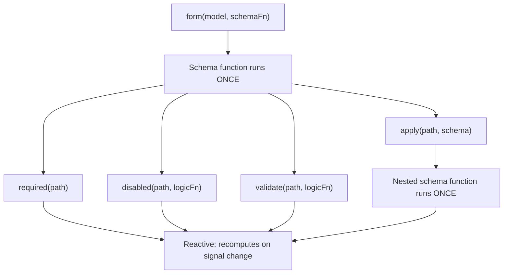

# スキーマとスキーマの合成性

シグナルフォームは2層のアーキテクチャを使って、_フォームがどのように構造化されるか_ と _実行時にどのように振る舞うか_ を分離します。

`form()` にスキーマ関数を渡すと、その関数はフォーム作成時に _一度だけ_ 実行されます。この関数の役割は、どのフィールドに検証があり、どのフィールドが無効になり、どのフィールドが他のフィールドに依存するかを宣言して、フォームのロジックツリーを設定することです。これがフォームの **構造レイヤー** です。

スキーマ関数の中では、`disabled()` や `validate()` などのルール関数を呼び出します。これらのルール関数は、参照しているシグナルが変わるたびに再計算されるリアクティブロジックを受け取ります。`disabled()` や `required()` のような条件付きルールは、そのルールを有効にする `when` 関数を含む任意の設定を受け取れます。これらが一緒になって、実行時のフォームの **振る舞いレイヤー** を形成します。

```ts
contactForm = form(this.contactModel, (schemaPath) => {
  // Schema function: runs ONCE during form creation
  required(schemaPath.name);
  disabled(schemaPath.couponCode, {when: ({valueOf}) => valueOf(schemaPath.total) < 50});
  //  ^^^ Reactive logic: recomputes when total changes
});
```



この区別は、スキーマを合成するときに重要です。`apply()`、`applyWhen()`、`schema()` のような関数はすべて構造レイヤーで動作するためです。スキーマは、_どの_ ルールが存在し、それらが _有効かどうか_ を制御します。一方でルール関数は、それらのルールが _何を_ 評価するかを定義します。

## `schema()` で再利用可能なスキーマを作成する {#create-reusable-schemas-with-schema}

複数のフォームが共通のデータ形状に対して同じルールを共有する場合、`schema()` 関数を使ってそれらのルールを再利用可能なスキーマとして抽出できます。

```ts
import {schema, required, minLength} from '@angular/forms/signals';

const nameSchema = schema<{first: string; last: string}>((name) => {
  required(name.first);
  required(name.last);
  minLength(name.first, 2);
  minLength(name.last, 2);
});
```

`schema()` 関数は関数をラップし、再利用可能な `Schema<T>` オブジェクトに変換します。他のスキーマ関数と同じように、フォームごとに _一度だけ_ 実行されますが、オブジェクト自体は必要なだけ多くのフォームで共有できます。

TIP: ルールが1か所にしか現れない場合は、インラインのスキーマ関数でも同じように機能します。複数のフォームで同じスキーマを再利用したい場合や、同じスキーマを複数のパスに適用したい場合に `schema()` を使います。再利用可能な `Schema` オブジェクトはフォームのコンパイルごとにキャッシュされます。

### `apply()` でスキーマを使用する {#using-the-schema-with-apply}

`apply()` 関数を使うと、再利用可能なスキーマをフォーム内の特定のパスに適用できます。`apply()` を呼び出すと、スキーマはそのサブパス内のフィールドだけを参照するスコープ付きパスを受け取ります。

```ts
import {apply} from '@angular/forms/signals';

profileForm = form(this.profileModel, (schemaPath) => {
  apply(schemaPath.name, nameSchema);
});

registrationForm = form(this.registrationModel, (schemaPath) => {
  apply(schemaPath.name, nameSchema);
});
```

## `applyWhen()` による条件付きスキーマ {#conditional-schemas-with-applywhen}

NOTE: [フォームロジックの追加ガイド](guide/forms/signals/form-logic) では、インラインロジックを使った条件付きルールのために `applyWhen()` を紹介しました。このセクションでは、`applyWhen()` を再利用可能なスキーマと合成する方法を扱います。

一部のルールは、特定の条件下でのみ適用されるべきです。たとえば、郵便番号フィールドは、選択された国が米国の場合にのみ検証を必要とすることがあります。

`applyWhen()` 関数は、リアクティブな状態に基づいてスキーマを条件付きで適用します。この関数は3つの引数を受け取ります。

1. スキーマを適用するパス
1. スキーマが有効になるべきときに `true` を返すリアクティブロジック関数
1. 条件付きルールを含むスキーマまたはスキーマ関数

```ts
import {form, applyWhen, required, pattern} from '@angular/forms/signals';

addressForm = form(this.addressModel, (schemaPath) => {
  applyWhen(
    schemaPath,
    ({valueOf}) => valueOf(schemaPath.country) === 'US',
    (schemaPath) => {
      required(schemaPath.zipCode);
      pattern(schemaPath.zipCode, /^\d{5}(-\d{4})?$/);
    },
  );
});
```

ロジック関数は `FieldContext` を受け取り、`value`、`valueOf`、`stateOf`、その他のリアクティブヘルパーにアクセスできます。これはリアクティブなので、条件が読み取るシグナルが変わるたびに再評価されます。条件が `false` になると、スキーマ内のルールは非アクティブになります。再び `true` になると、それらのルールは再アクティブ化されます。

スキーマ自体は引き続き構造的です。つまり、スキーマ関数はフォーム作成時に一度だけ実行されます。条件が制御するのは、それらのルールの _アクティブ_ 状態であり、ルールの _存在_ ではありません。

条件付きスキーマの中では、そのスキーマ関数に渡されたスコープ付きパスパラメータを使います。外側のスキーマのパスは、ネストされたスキーマ内では有効ではありません。

### `applyWhen()` と再利用可能なスキーマを組み合わせる {#combining-applywhen-with-reusable-schemas}

`applyWhen()` は `Schema` オブジェクトを受け取れるため、`schema()` と組み合わせて再利用可能なスキーマを条件付きで適用できます。

```ts
const usZipCodeSchema = schema<{zipCode: string}>((address) => {
  required(address.zipCode);
  pattern(address.zipCode, /^\d{5}(-\d{4})?$/);
});

const caPostalCodeSchema = schema<{postalCode: string}>((address) => {
  required(address.postalCode);
  pattern(address.postalCode, /^[A-Z]\d[A-Z] \d[A-Z]\d$/);
});

shippingForm = form(this.shippingModel, (schemaPath) => {
  applyWhen(
    schemaPath.address,
    ({valueOf}) => valueOf(schemaPath.country) === 'US',
    usZipCodeSchema,
  );
  applyWhen(
    schemaPath.address,
    ({valueOf}) => valueOf(schemaPath.country) === 'CA',
    caPostalCodeSchema,
  );
});
```

NOTE: ロジック関数は、パス引数が `schemaPath.address` であっても `valueOf(schemaPath.country)` にアクセスしています。これは、`valueOf` ヘルパーが、スコープ付きパス内のフィールドだけでなくフォーム内の任意のフィールドにアクセスできるためです。

このパターンにより、検証ロジックはモジュール化された状態に保たれます。各国の住所ルールはそれぞれ独自のスキーマに置かれ、フォームはユーザーの選択に基づいてどれを有効にするかを選びます。

## `applyWhenValue()` による型の絞り込み {#type-narrowing-with-applywhenvalue}

`applyWhenValue()` 関数は、フィールドの値だけを確認すればよい条件を簡略化します。`FieldContext` を受け取る代わりに、条件関数はフィールドの生の値を直接受け取ります。

```ts {header: "applyWhen — logic function receives FieldContext"}
applyWhen(schemaPath.payment, ({value}) => value().type === 'credit-card', creditCardSchema);
```

```ts {header: "applyWhenValue — condition receives the value directly"}
applyWhenValue(schemaPath.payment, (payment) => payment.type === 'credit-card', creditCardSchema);
```

`applyWhenValue()` の主な利点は、TypeScriptの型ガードをサポートしていることです。条件関数が型ガードである場合、スキーマの型パラメータはガードされた型に絞り込まれます。これは、各バリアントに異なるルールが必要な異なるフィールドがある判別共用体でとくに便利です。

```ts
import {form, applyWhenValue, required} from '@angular/forms/signals';

interface CreditCard {
  type: 'credit-card';
  cardNumber: string;
  expiry: string;
  cvv: string;
}

interface BankTransfer {
  type: 'bank-transfer';
  accountNumber: string;
  routingNumber: string;
}

type PaymentMethod = CreditCard | BankTransfer;

function isCreditCard(value: PaymentMethod): value is CreditCard {
  return value.type === 'credit-card';
}

function isBankTransfer(value: PaymentMethod): value is BankTransfer {
  return value.type === 'bank-transfer';
}

paymentForm = form(this.paymentModel, (schemaPath) => {
  applyWhenValue(schemaPath, isCreditCard, (payment) => {
    // TypeScript knows payment is scoped to CreditCard
    required(payment.cardNumber);
    required(payment.expiry);
    required(payment.cvv);
  });

  applyWhenValue(schemaPath, isBankTransfer, (payment) => {
    // TypeScript knows payment is scoped to BankTransfer
    required(payment.accountNumber);
    required(payment.routingNumber);
  });
});
```

型ガードがない場合、TypeScriptは各スキーマ関数の中でどのフィールドが利用できるかを判断できません。型の絞り込みにより、クレジットカードの分岐では `payment.cardNumber` へのアクセスが、銀行振込の分岐では `payment.accountNumber` へのアクセスが型安全であることが保証されます。

## `applyEach()` による配列項目 {#array-items-with-applyeach}

フォームにオブジェクトの配列が含まれる場合、多くの場合はすべての項目に同じルールを適用する必要があります。`applyEach()` 関数は、存在する項目数に関係なく、配列フィールド内の各項目にスキーマを適用します。

```ts
import {form, applyEach, required, min} from '@angular/forms/signals';

type LineItem = {name: string; quantity: number};

orderForm = form(this.orderModel, (schemaPath) => {
  required(schemaPath.title);

  applyEach(schemaPath.items, (item) => {
    required(item.name);
    min(item.quantity, 1);
  });
});
```

`applyEach()` に渡されたスキーマ関数は、単一の配列項目にスコープされた `SchemaPathTree` を受け取ります。内部で宣言されたルールは、フォーム作成後に追加された項目を含む、配列内のすべての項目に適用されます。

### `applyEach()` と再利用可能なスキーマを組み合わせる {#combining-applyeach-with-reusable-schemas}

`applyEach()` は `Schema` オブジェクトを受け取れるため、項目レベルのルールを再利用可能なスキーマに抽出し、複数のフォーム間で共有できます。

```ts
const lineItemSchema = schema<LineItem>((item) => {
  required(item.name);
  min(item.quantity, 1);
});

orderForm = form(this.orderModel, (schemaPath) => {
  required(schemaPath.title);
  applyEach(schemaPath.items, lineItemSchema);
});

invoiceForm = form(this.invoiceModel, (schemaPath) => {
  required(schemaPath.invoiceNumber);
  applyEach(schemaPath.lineItems, lineItemSchema);
});
```

TIP: フィールドごとのカスタムエラーメッセージを含め、配列項目の検証について詳しくは、[検証ガイド](guide/forms/signals/validation) を参照してください。

## 次のステップ {#next-steps}

シグナルフォームについてさらに学ぶには、次の関連ガイドを確認してください。

- [フォームロジックの追加](guide/forms/signals/form-logic) - 条件付きロジック、動的な振る舞い、メタデータをフォームに追加する方法を学ぶ
- [検証](guide/forms/signals/validation) - 検証ルールとエラー処理について学ぶ
- [非同期操作](guide/forms/signals/async-operations) - フォーム送信と非同期検証の扱い方を学ぶ
